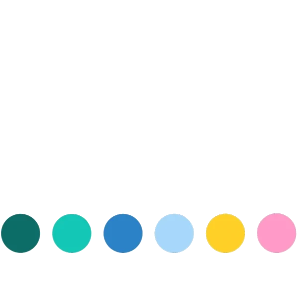

### Всем привет 👋 Добро пожаловать на мой профиль :v:

:trophy: У меня 9 лет коммерческого опыта в ИТ сфере. На текущий момент работаю QA специалистом и двигаюсь как T-Shape специалист.

## Чем я занимаюсь сейчас?

:dart: В настоящий момент я изучаю процесс полного выстраивания автоматизации и применяю это в своей работе. Я прохожу курс на **[QA.GURU school](https://qa.guru)**. На курсе мы практикуем следующие инструменты автоматизации:

  
  
  
  
  
  
  
  
  

<h2> Мои проекты </h2>

  
  

  <h2>Языки и инструменты</h2>
 

   
  <code></code>
  <code></code>
  <code></code>
  <code></code>
  <code></code>
  
  <code></code>
  <code></code>
  <code></code>
  <code></code>
  <code></code>
  
  <code></code>
  <code></code>
  <code></code>
  <code></code>
  <code></code>
<!-- <code></code> -->
 

  

<!--
**andreyzavrichko/andreyzavrichko** is a ✨ _special_ ✨ repository because its `README.md` (this file) appears on your GitHub profile.

Here are some ideas to get you started:

- 🔭 I’m currently working on ...
- 🌱 I’m currently learning ...
- 👯 I’m looking to collaborate on ...
- 🤔 I’m looking for help with ...
- 💬 Ask me about ...
- 📫 How to reach me: ...
- 😄 Pronouns: ...
- ⚡ Fun fact: ...
-->
